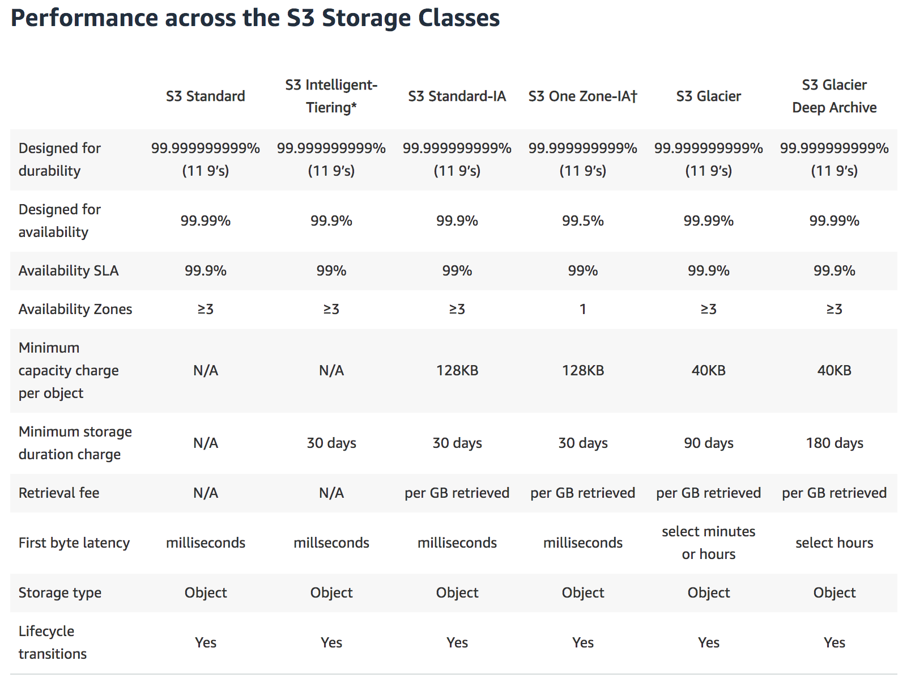

- [S3 - Simple Storage Service](#s3---simple-storage-service)
  - [S3 101](#s3-101)
    - [What's S3](#whats-s3)
    - [Working with S3 buckets](#working-with-s3-buckets)
    - [Useful Links](#useful-links)
    - [Object Components](#object-components)
    - [Data Consistency for S3](#data-consistency-for-s3)
    - [Guarantees](#guarantees)
    - [Features](#features)
    - [S3 Storage Tiers](#s3-storage-tiers)
    - [Charges](#charges)
  - [S3 Security & Encryption](#s3-security--encryption)
  - [S3 Version Control](#s3-version-control)
  - [S3 Lifecycle Management](#s3-lifecycle-management)
  - [S3 Cross Region Replication](#s3-cross-region-replication)
  - [S3 Transfer Acceleration](#s3-transfer-acceleration)

# S3 - Simple Storage Service

## S3 101

### [What's S3](https://docs.aws.amazon.com/AmazonS3/latest/dev/Introduction.html)

Amazon S3 is object storage built to store and retrieve any amount of data from anywhere on the Internet.

It is an object storage service that offers industry-leading scalability, data availability, security, and performance.

- Object-based storage: you can save only object (_read files_), you can't, for example, install an OS (In this case you need block-based storage)
- Files are stored in a **Bucket** (folder in cloud)
- **S3 is a universal namespace**, so bucket name must be unique globally
- By default, all buckets when created are PRIVATE.
- Files can save from 0 Bytes to 5 TB
- No storage Limits. Store as many files as you want
- Sample of an S3 URL for bucket *varmeh* & object *photo.jpg*: 
  - Path Style Url: `https://s3-eu-west-1.amazonaws.com/varmeh/photo.jpg`
  - Virtual Hosted Style Url: `https://varmeh.s3-eu-west-1.amazonaws.com//photo.jpg`
- For a successful upload an object in S3, you get an HTTP 200 status code back
- By default, you can create up to 100 buckets in each of your AWS accounts. This limit could be increased to 1000 by submitting a service limit increase.

### Working with S3 buckets

- [Creating a bucket]()

### Useful Links

- [Developer Guide](https://docs.aws.amazon.com/AmazonS3/latest/dev/Welcome.html)
- [FAQs](https://aws.amazon.com/s3/faqs/#general)

### Object Components

- Objects consist of:
  - Key (name of the object)
  - Value (data)
  - Version ID (Used for versioning)
  - Metadata (a set of data that describes and gives information about the object data)
  - Subresources:
    - Access Control List (for access control at object level)
    - Torrent (Not an exam topic)

### Data Consistency for S3

- _Read after Write Consistency for PUTS of new Objects_: PUTS is used to create new objects. It's consistent in reads after a write on new objects
- _Eventual Consistency for overwrite PUTS & DELETE_: It's eventually consistent for overwriting and deletes i.e. it can take some time to propagate
- _Atomic Updates_: if you PUT to an existing key, a subsequent read might return the old data or the updated data, but it will never return corrupted or partial data
- S3 is spread across multiple AZ's

### Guarantees

- _Availability_: Built for 99.9% availability
- _Durability_: S3 guarantees 11x9s (99.999999999) durability for S3 information

### Features

- Tiered Storage (classes) available
- Lifecycle Management - Move files between different S3 tiers
- Versioning
- Supports [multi-part upload](https://docs.aws.amazon.com/AmazonS3/latest/dev/mpuoverview.html)
- Encryption
- MFA (Multi-Factor Authentication) Delete
- Access Control (_permissions on single files_) and Bucket Policies (_permissions on buckets_)

### [S3 Storage Tiers](https://aws.amazon.com/s3/storage-classes/)

- **S3 standard**: 99.99% availability, 11x9s durability. It can sustain the loss of 2 facilities concurrently
- **S3 - IA**: (_Infrequently Accessed_): For data that is accessed less frequently, but needs rapid access. You are charged a retrieval fee per GB retrieved
- **S3 One Zone - IA**: Like S3 IA but data is stored only in one Availability Zone
- **S3 - Intelligent Tiereing**: Designed to optimized costs by automatically moving data to most cost effective tier access, without performance degrade or operational overhead
- **S3 Glacier**: It for data archieving. Very reasonable in terms of costs. _Retrieval times configurable from minutes to hrs_. It has been further divided into 3 categories:

  - _Expedited_: few minutes for retrieval
  - _Standard_: 3-5 hours for retrieval
  - _Bulk_: 5-12 hours for retrieval

- **S3 Glacier Deep Archieve**: long term storage with lowest retrival cost & retrieval time of upto 12 hrs

### [Charges](https://aws.amazon.com/s3/pricing/)

S3 is charged for:

- Storage
- Requests
- Storage management pricing (read _Storage Tier Pricing_)
- Data Transfer Pricing
- Transfer acceleration - Using CloudFront (the AWS CDN) at edge locations
- Cross Region Replication

## S3 Security & Encryption

Two types of encryption involved:

- **Encryption in Transit**:

  - Refers to secure communication over internet
  - Mainly achieved by HTTPS
  - Encryption used for HTTPS is **SSL/TLS**

- **Encryption at Rest**:

  - Save the data on cloud after encrypting it
  - It could be achieved in 2 ways:

    - **Client Side Encryption**:

      - Encrypt data client-side and upload the encrypted data to Amazon S3
      - In this case, developer manages the encryption process, the encryption keys, and related tools

    - **Server Side Encryption**:

      - Request Amazon S3 to encrypt your object before saving it on disks in its data centers and then decrypt it when you download the objects
      - AES-256 Encryption
      - **3 mutually exclusive** options to manage your encryption keys:

        - [Use Server-Side Encryption with Amazon S3-Managed Keys (SSE-S3)](https://docs.aws.amazon.com/AmazonS3/latest/dev/UsingServerSideEncryption.html):

          - It provides an integrated solution where Amazon handles key management and key protection using multiple layers of security
          - Each object is encrypted with a unique key
          - As an additional safeguard, it encrypts the key itself with a master key that it regularly rotates

        - [Use Server-Side Encryption with AWS KMS-Managed Keys (SSE-KMS)](https://docs.aws.amazon.com/AmazonS3/latest/dev/UsingKMSEncryption.html):

          - It enables you to use AWS Key Management Service (AWS KMS) to manage your encryption keys
          - AWS KMS uses customer master keys (CMKs) to encrypt your Amazon S3 objects
          - AWS KMS provides an audit trail so you can see who used your key to access which object and when, as well as view failed attempts to access data from users without permission to decrypt the data
          - You can choose to create and manage encryption keys yourself, or you can choose to use your default service key uniquely generated on a customer by service by Region level

        - [Use Server-Side Encryption with Customer-Provided Keys (SSE-C)](https://docs.aws.amazon.com/AmazonS3/latest/dev/ServerSideEncryptionCustomerKeys.html):

          - SSE-C enables you to leverage Amazon S3 to perform the encryption and decryption of your objects while retaining control of the keys used to encrypt objects
          - Here customer provides encryption/decryption keys
          - Customer manages a mapping of which encryption key was used to encrypt which object

## [S3 Version Control](https://docs.aws.amazon.com/AmazonS3/latest/dev/Versioning.html)

- Stores all versions of an object, including the over-written & deleted one's as well
- Use versioning to preserve, retrieve, and restore every version of every object stored in your Amazon S3 bucket
- Once enabled, **Versioning can't be disabled**, only suspended
- _Updated version of an object is PRIVATE by default_. Permissions of older versions are kept intact. In essence, each version access is independent to others
- It integrates with Lifecycle rules
- You pay for each version you have
- Delete an object:
  - Once you delete a file inside a versioned bucket, file is not deleted. Instead, a _Delete Marker_ is added to file metadata (_this basically creates a new version of the object_)
  - Deleting the version with the _Delete Marker_ will basically restore the object
  - To permanently delete the object, delete all the Versions of the object
  - You can optionally add another layer of security by configuring a bucket to enable **MFA Delete**

More info about versioning:

- [ObjectVersioning](https://docs.aws.amazon.com/AmazonS3/latest/dev/ObjectVersioning.html)
- [Versioning](https://docs.aws.amazon.com/AmazonS3/latest/dev/Versioning.html)

## [S3 Lifecycle Management](https://docs.aws.amazon.com/AmazonS3/latest/dev/object-lifecycle-mgmt.html)

- It is used to manage objects tiers so that they are stored cost effectively throughout their lifecycle
- A lifecycle configuration is a set of rules that define **actions** that Amazon S3 applies to a group of objects
- These actions are intended to reduce usage cost. So, transitions are allowed only from higher cost to lower cost storage tier
- There are two types of actions:

  - **Transition actions** — Define when objects transition to another storage class
  - **Expiration actions** — Define when objects expire

- **Allowed Transitions**:

  - STANDARD storage class to any other storage class
  - Standard_IA to INTELLIGENT_TIERING or ONEZONE_IA
  - INTELLIGENT_TIERING to ONEZONE_IA
  - Any storage class to GLACIER or DEEP_ARCHIEVE
  - GLACIER to DEEP_ARCHIEVE

- Interesting Queries:
  - [S3 Expiry and Permanently delete Lifecycle rules](https://acloud.guru/forums/aws-csa-2019/discussion/-Ligt1fcro5OloaS6CwN/s3_expiry_and_permanently_dele)
  - [Lifecycle vs Intelligent Tiering](https://aws.amazon.com/blogs/aws/new-automatic-cost-optimization-for-amazon-s3-via-intelligent-tiering/)

## [S3 Cross Region Replication](https://docs.aws.amazon.com/AmazonS3/latest/dev/crr.html)

- Versioning must be enabled for both source & destination buckets
- Regions must be unique
- Files in an existing bucket are not replicated automatically
- All subsequent new/updated files would be replicated automatically
- In order to replicate the existing objects, you need to do a `cp` using the aws cli:

  `aws s3 cp --recursive s3://alessio-casco-versioning s3://alessio-casco-versioning-replica-sydney`

- If you delete an object in the primary bucket, the delete action and _Delete Markers_ won't be replicated in destination bucket. Only creations and modifications are replicated & not Delete
- You can't replicate over multiple buckets, the maps are always 1-to-1

## [S3 Transfer Acceleration](https://docs.aws.amazon.com/AmazonS3/latest/dev/transfer-acceleration.html)

- It enables fast, easy and secure transfers of files over long distances between client and an S3 bucket
- Transfer Acceleration takes advantage of **Amazon CloudFront’s globally distributed edge locations**
- Instead of uploading directly to S3 bucket, user uploads to an Edge location which will then transfer the file to S3
- User get a distinct Url to upload (_one of Edge location, instead of bucket_)
